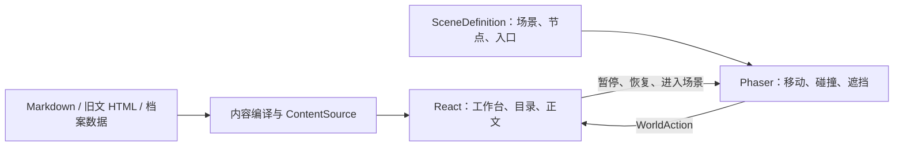

# 徒手拆机甲 · 个人工作台与机甲档案馆

「徒手拆机甲」的个人主页。文章、项目和个人档案可以直接阅读；喜欢探索的访客，也可以走进机甲，沿维修栈道进入不同舱室。游戏是了解内容的另一条路，所有文章和作品都不需要通关才能访问。

本仓库同时保存当前网站与早期「林间小院」的独立学习案例，保留已有开发历史。仓库目前为私有，未授予项目整体的开源许可证。

- [当前网站](https://tscjj-mecha-archive.c66745946.chatgpt.site/)：现有托管受众为仅所有者，不是对外公开演示。
- [林间小院学习案例](examples/forest-courtyard/README.md)：独立运行旧版场景，阅读机制讲解并动手修改。
- [日常维护](docs/MAINTENANCE.md) · [GitHub 维护与版本恢复](docs/GITHUB-MAINTENANCE.md) · [来源记录](docs/SOURCES.md)

## 当前版本可以做什么

- **有质感的入口**：四幅机甲开屏原画随机呈现，可选择直接进入工作台或探索世界。
- **直接使用的工作台**：文章检索、栏目、个人档案和项目都有明确入口。六个项目按网络工程、数据与算法、效率工具分类；提供地址规划、相册筛选、配送路径、日均成本四种交互示例，以及两个源码流程导览。
- **可选的机甲探索**：2.5D 外景连接航迹室、旧纸库和试作间，含轻量物件反馈、音乐和可选小游戏。阅读面板打开时暂停移动，关闭后继续探索。
- **渐进灯阵**：12 关分三个阶段，从 4×4 到 5×5；提供提示、撤回、重来和本次游玩的最佳步数记录。刷新后重置成绩。
- **可维护的文章档案**：74 篇公开旧文已迁入，保留日期、标签和来源链接；另有 4 篇待核对草稿。教育、经历和荣誉由独立数据文件管理。
- **独立的私藏边界**：私人记录以密文保存，服务端同时验证主人身份与独立密码。未配置完整运行环境时拒绝访问，不影响普通文章。

项目预览会说明自己的范围：OSPF 的地址与配置在本地计算，应用、下发与 Ping 是模拟回执；配送和成本是交互示意；流程导览不会真正启动虚拟机或向外发布内容。

## 快速开始

推荐 **Node.js 24**，项目最低要求为 22.13。使用 npm 与已提交的锁文件。私有仓库克隆需要先登录有权限的 GitHub 账号。

```sh
git clone https://github.com/1205240810/personal-homepage.git
cd personal-homepage
npm ci
npm run dev
```

访问终端显示的本地地址，默认是 `http://localhost:3000/`。开发模式自动编译文章目录，并包含明确标记的四篇草稿；工作台精选仍只展示正式文章。普通阅读和探索不需要配置私藏室密码。

```sh
npm run check          # 编译内容、类型检查、世界/文章/项目/灯阵验证
npm run build          # 正式构建，仅含已发布文章
npm run build:preview  # 私有审阅构建，包含待核对草稿
npm run maps           # 场景配置变更后，同步 Tiled 地图
```

首次克隆即可运行 `check`；其前置脚本会生成被 Git 忽略的文章索引。`build:preview` 只用于私有审阅。`noindex` 不是访问控制，网站访问范围由托管设置决定。

### 单独运行林间小院

```sh
cd examples/forest-courtyard
npm ci
npm run dev
```

打开 `http://127.0.0.1:5173/`。它有自己的依赖、锁文件和内置教学文章，无需启动主网站，也不依赖原博客后台、Sites 或私藏室配置。

也可以在根目录运行 `npm run example:forest`、`npm run check:forest`、`npm run build:forest`；首次仍需在案例目录安装依赖。

## 页面与实现入口

| 地址 | 内容 | 主要文件 |
| --- | --- | --- |
| `/` | 随机机甲引导页 | `app/page.tsx`、`lib/arrival-art.ts` |
| `/workbench` | 直接阅读与项目试用 | `components/home/project-library.tsx` |
| `/archive`、`/posts/:slug` | 文章目录与独立正文 | `lib/content/source.ts`、`content/` |
| `/projects` | 项目列表与源链接 | `content/data/projects.json` |
| `/about` | 简介、教育、经历与荣誉 | `content/data/profile.json`、`awards.json` |
| `/explore` | 机甲世界与舱室 | `lib/world/registry.ts`、`engine.ts` |
| `/vault` | 主人私藏入口 | `lib/private-vault/`、`app/api/vault/` |

文章 ID、公开 slug 与地图坐标相互独立。移动或重画书架不会改变文章地址；新增文章自动进入对应栏目。



主站使用 React、TypeScript、Vinext / Vite、Phaser 与 Tiled JSON，部署产物包含 Cloudflare Worker 服务端。Phaser 只在探索页按需加载；引导页和直接阅读入口不必启动游戏。

## 仓库结构

```text
app/                         页面与服务端接口
components/home/             工作台、项目预览、灯阵小游戏
components/world/            游戏与 React 阅读面板的连接
lib/content/                 内容读取接口；generated.json 由脚本生成
lib/world/                   场景注册、角色、导航、碰撞、遮挡
lib/private-vault/           私藏室服务端逻辑与加密档案
content/                     公开文章、待核对草稿、档案与项目数据
public/                      场景美术、音乐、正文资源、Tiled 地图
scripts/                     内容编译、导入、地图生成与检查
docs/                        维护、来源、设计记录与验收说明
examples/forest-courtyard/    早期林间小院的独立学习案例
```

| | 当前主页 | 林间小院案例 |
| --- | --- | --- |
| 目的 | 持续维护的个人网站 | 理解交互空间的教学项目 |
| 启动 | 根目录 `npm run dev` | 案例目录 `npm run dev` |
| 内容 | 真实公开文章、档案与项目 | 三篇教学笔记与两个已公开项目外链 |
| 路由 | 服务端页面与 API | 浏览器 Hash 路由 |
| 构建 | Vinext + Cloudflare Worker | Vite 静态产物 |
| 相互关系 | 不加载案例代码和资源 | 不导入主站源码，不连接主站接口 |

案例目录已从主站 TypeScript 检查范围排除，其资源不在主站 `public/` 中。两边各自检查和构建，修改教学案例不会自动改变线上场景。

## 维护与历史

常见修改先从 [内容与世界维护](docs/MAINTENANCE.md) 查找入口。提交、拉取和恢复旧版本见 [GitHub 维护说明](docs/GITHUB-MAINTENANCE.md)。**推送 GitHub 只保存源码，不会自动重新发布 Sites 网站。** 主站包含服务端接口，不能直接当作 GitHub Pages 静态站发布。

- `archive/forest-courtyard`：早期林间小院，原始提交 `archive/forest-courtyard`。
- `archive/river-journey`：后续河谷漫游，原始提交 `archive/river-journey`。
- `examples/forest-courtyard/`：从林间小院提取、适配后的可维护教学副本，保留原场景逻辑与美术，并非完整旧站的逐字复制。

原始备份、`.env*`、`.dev.vars*`、依赖和构建产物不进入 Git。私藏室的运行条件与当前配置限制见 [私藏室维护](docs/PRIVATE-VAULT.md)，普通文章维护不需要运行重新加密脚本。

## 来源与许可

参考项目、依赖与 Kevin MacLeod 的背景音乐署名见 [THIRD_PARTY_NOTICES.md](THIRD_PARTY_NOTICES.md)。博客原文保留来源链接。第三方组件和音乐遵循各自许可证；这不等于仓库内全部原创代码、美术及文章已获统一开源授权。
