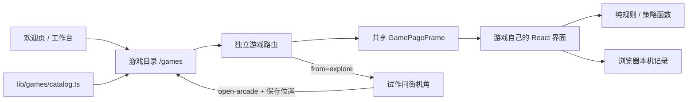

# 游戏室与扩展

游戏室是个人主页里的独立休息区。文章、作品和档案仍可以直接访问，探索和游戏成绩不会解锁或限制内容。新游戏先做好自己的玩法和页面，再加入轻量目录；不为几款游戏搭建通用插件系统或空后台。

## 入口与页面

| 地址                    | 功能                                       |
| ----------------------- | ------------------------------------------ |
| `/games`                | 选择实际可玩的游戏                         |
| `/games/holdem-lab`     | 2–9 人自定义练习室，逐步决策评分与教学复盘 |
| `/games/blackjack`      | 标准筹码 21 点、新手教程及原有休闲模式     |
| `/games/sudoku`         | 120 道数独、题库选题和逐步推理教练         |
| `/games/yahtzee`        | 十三分栏快艇骰子、AI 对局及完整中途存档    |
| `/games/stud`           | 双人五张梭哈、封顶下注和赛后权益分析       |
| `/games/signal-pulse`   | 十二关灯阵，支持选关、提示、撤回与重来     |
| `/games/circuit-repair` | 旋转线路接通全部端点灯，四种尺寸与今日线路 |
| `/games/mech-sweeper`   | 机甲主题扫雷，三档难度、今日检修与保险丝   |
| `/games?from=explore`   | 从机甲街机角进入，主要返回入口为机甲       |

欢迎页的游戏室链接作为次要入口，保留工作台和进入机甲的选择。工作台通过主导航和侧栏通向游戏室。机甲内部的试作间设有可交互街机角；直接访问游戏页面时不需要先启动 Phaser 世界。

`?from=explore` 只记录来路，不包含用户资料或游戏成绩。选择游戏后继续保留此参数，返回游戏室时也保留；「返回机甲」统一打开 `/explore`，让世界读取已有本机存档，不使用 scene 参数重新指定场景。世界离开前停止输入并保存位置，返回后仍在原场景的街机旁；世界布局版本变化或存储不可用时按原有安全出生点恢复。

游戏室顶部有两块快捷入口：

- **今日挑战**：列出 `GAMES` 中设置了 `daily` 字段的游戏（目前是线路检修和机甲扫雷）。这类游戏按日期生成题目，同一天所有人拿到同一张。新增带每日题的游戏时，只需给目录项填写 `daily` 说明。
- **最近玩过**：每个游戏页面挂载 `RecentGameMark`（`GamePageFrame` 已内置；德州、21 点和三款独立游戏在各自的 `page.tsx` 中挂载），在 `tscjj:games:recent:v1` 中保存最近 4 个游戏的 ID 和访问时间，不保存成绩或其他资料。游戏室在 hydration 之后才读取；存档损坏时丢弃无效项，首次访问不显示这一块。规则和存储由 `scripts/check-recent-games.ts` 验证，界面由 `qa/game-room.check.tsx` 验证。

## 模块边界

| 文件或目录                                  | 职责                                                       |
| ------------------------------------------- | ---------------------------------------------------------- |
| `lib/games/catalog.ts`                      | 稳定 ID、路由与游戏目录文案                                |
| `app/games/page.tsx`                        | 游戏室页面，读取来路参数                                   |
| `components/games/game-room.tsx`            | 目录展示与共享 `GamePageFrame`                             |
| `components/games/games.css`                | 导航、目录、页框、手机布局与减少动态效果                   |
| `lib/games/holdem-engine.ts`                | 发牌、盲注、合法行动、换街与底池结算                       |
| `lib/games/holdem-cards.ts`                 | 牌型比较与蒙特卡洛权益估计                                 |
| `lib/games/holdem-strategy.ts`              | 本地 AI 行动与策略复盘                                     |
| `lib/games/holdem-replay.ts`                | 仅在整手结束后生成全桌回放，并校验本机归档                 |
| `components/games/holdem-worker.ts`         | 将权益和复盘计算放到 Worker 中                             |
| `lib/games/holdem-music.ts`                 | 原创编曲、音量与音源生命周期                               |
| `lib/games/holdem-voice.ts`                 | 可选中文行动播报与自身语音队列清理                         |
| `public/assets/poker/portraits/`            | 九席原创透明人物素材                                       |
| `standalone/blackjack/src/`                 | 暗牌 21 的单一维护源码、纯规则和教练                       |
| `scripts/sync-blackjack.mjs`                | 构建前同步独立游戏到宿主运行组件                           |
| `components/games/blackjack/`               | 客户端按需加载、宿主导航与生成源码                         |
| `standalone/{sudoku,yahtzee,stud}/`         | 三款独立游戏的维护源码、测试与离线文件                     |
| `scripts/sync-standalone-games.mjs`         | 同步十八个运行文件，检查生成目录是否过期                   |
| `components/games/standalone-game-room.tsx` | 三款游戏的按需加载、来路导航和备案入口                     |
| `lib/pulse-puzzle.ts`                       | 灯阵关卡、按键翻转与最短解求解                             |
| `components/home/pulse-game.tsx`            | 两种入口共同复用的灯阵界面                                 |
| `lib/games/circuit-repair.ts`               | 线路检修的生成树出题、通电判定、提示与本机最佳记录         |
| `components/games/circuit-repair.tsx`       | 线路检修界面：旋转、锁定、撤回、计时与键盘操作             |
| `lib/games/mech-sweeper.ts`                 | 机甲扫雷的出题、首扫安全、展开与连开、保险丝和本机记录     |
| `components/games/mech-sweeper.tsx`         | 机甲扫雷界面：扫描、右键/长按/标记模式插旗、计时与键盘操作 |
| `lib/world/registry.ts`                     | 机甲内街机节点、站位与家具定义                             |
| `lib/world/arcade-cabinet.ts`               | 跟随室内透视绘制的街机纹理                                 |

目录只描述已经能打开的游戏，不依赖游戏内部状态。路由 ID 与中文名称分离；可以修改游戏标题和简介，而不随意改变分享地址。`GamePageFrame` 为普通游戏统一返回导航与 ICP 信息；扑克使用独立整屏布局，并保留相同的返回与备案入口。游戏组件负责自己的操作、提示、胜负和记录。

入口使用完整文档导航，离开后释放计算 Worker 与游戏事件，探索位置由既有存档恢复。当前 Vinext 版本的 `next/link` 在生产产物自动预加载时会报错；这次按实际问题保留普通链接，不为通过该框架专用 lint 规则引入失效预加载。

## 德州扑克的实现范围

这是 2–9 人无限注德州扑克的虚拟练习室：玩家固定为席位 0，其余席位由本地 AI 控制。可自行设置小盲、大盲和每席初始筹码；桌况与难度在新的一手锁定，进行中的牌局不受待应用设置影响。相同配置下延续结算后的余额，低于大盲的席位下一手补至初始筹码；改变人数、盲注或初始筹码时，整桌按新配置重开。

盲注与筹码必须是安全整数：小盲至少 1、严格小于大盲，大盲不超过 100,000，每席初始筹码至少一个大盲且不超过 10,000,000。人数变更后按钮归一到新席位范围；两人桌采用按钮兼小盲、翻牌前先行动，另一人兼大盲、翻牌后先行动的规则。

下注经历翻牌前、翻牌、转牌、河牌和摊牌。玩家弃牌后其余席位继续行动，不提前结束整手；各层主池、边池独立判断可争夺席位并结算，无法被匹配的超额投入退回。筹码用于练习，不存在充值、提现、付费下注或真钱结算。

### AI 与难度

AI 使用本地混合策略，打法风格与难度分别管理。席位按均衡、稳健、积极与灵活四种风格分配，不同人数会改变行动顺序、位置与多人底池判断；难度控制范围抽样和策略判断的深度，不通过偷看底牌增加难度。调整难度从下一手生效，当前手保持原设置。

策略只读取自己的底牌、当时的公共牌、筹码、位置与已发生的公开行动。权益按推断的对手范围抽样，排除已知牌并避免不同席位拿到重复牌；多人平局按实际份额计算。范围权重是可解释的本地模型，并非从专业求解器获得的范围表，也不调用联网大模型。

选择性诈唬区分低摊牌价值的纯诈唬与听牌半诈唬，结合位置、对手人数、公开跟注和牌面相关的 A 高同花阻挡牌；不会把任意 A 自动当作河牌坚果阻挡牌。当前保守策略在有全下对手时关闭纯诈唬和半诈唬触发分支：无法通过弃牌赢走仍须摊牌的主池，边池价值须另行判断。持续下注只在翻牌前进攻者面对尚未下注的翻牌时触发，不将翻牌再加注称为持续下注。复盘解释新增有效风险与立即弃牌收益，并明确纯诈唬静态门槛 `风险 / (风险 + 当前底池)` 的「被跟注必输、忽略后续下注」条件；半诈唬的补牌权益不能直接套用该公式。

### 每次决策的评分与解释

复盘只使用每次行动当时的局面。每个记录先给一句结论，然后拆成具体理由、推荐动作的目的、下注尺度、其他选择的取舍和下一步思考。依据手牌、当时牌面、位置、赔率、SPR 与公开行动组织说明；候选 EV、范围假设和模型限制按需展开，避免长篇重复术语。

普通尺度动作提供 0–100 模型评分；每个实际动作都保留推荐动作与加注总额、候选模型 EV（以该手实际大盲为单位）、抽样误差与预估相对损失。GTO 概念说明区区分「整段范围的平衡」与「本手有限模型建议」，不虚构精确均衡混合频率。

所有候选动作共享抽样世界以减少比较噪声，实际选择的加注尺度也纳入候选。先逐项用 `候选 EV − 95% 抽样误差 − 该候选模型预留` 找到稳健锚点，再比较锚点附近动作的配对抽样容差和两项中较小的模型预留，优先减少投入。免费过牌不会被无必要的弃牌替代。模型基准预留为 `max(0.2 BB, 当前底池 × 12%) × 街道系数`，系数依次为翻牌前 1.75、翻牌 1.35、转牌 0.65、河牌 0.35；候选的有效新增风险扣除跟注后，超过跟注后两倍底池的部分另留 3%。弃牌增量已知为零，不作模型折价。极端尺度的容差只属于该候选，不能抬高其他普通下注的预留。

评分与不确定性分开：以普通尺度候选中最高的原始 EV 为数值参照，令 `损失 = max(0, 参照 EV − 本候选 EV)`，按 `100 × exp(−损失 / max(0.5 BB, 当前底池 × 25%))` 映射为一位小数的教学分。**不再从损失中扣除抽样误差或模型容差**，因此「暂时无法可靠区分」不再直接变成满分。参照与稳健推荐可能不同：数值参照说明局部估值排名，推荐仍考虑误差、模型敏感性和投入。界面同时展示参照差值与「估值接近／差异较清晰」，不能把小数精度视作策略精度。

有效风险超过跟注后两倍底池的极端尺度标为「估值敏感」，界面暂不显示数字评分，也不纳入平均分；候选 EV 与模型假设仍可检查。`regretBB` 保留相对全部候选数值最高值的差，`scoreGapBB` 则对应普通尺度参照，避免将极端数值峰值当作稳定评分依据。这个指数映射及尺度阈值是公开的教学启发式，未经专业 GTO 标签拟合或外部标定；分数不是 GTO 准确率、获胜概率或长期盈利能力评级。评分不因最终输赢、真实对手底牌或后来发出的牌改变；抽样误差不包含范围与响应假设的模型误差。

这是公开范围、一轮响应与风险折价模型。响应按当前牌面区分私人对子、公共配对与三条踢脚，并使用跟注者实际有资格争夺的底池和有效风险；超池下注以公开加权范围的强端设置保守的一轮防守参照，权重参照为 `1 / (1 + 有效下注/底池)`。这是局部启发式，**不是多人均衡防守频率**，不会读取实际对手底牌或未来公共牌。早期街对继续打到摊牌的权益实现和面对再加注的风险作启发式折价；这些折价并未展开实际后续下注树。模型尚未求解完整多轮博弈，不提供严格均衡、多轮真实 EV 或精确最优混合频率。翻牌前和早期街尤其依赖范围与权益实现假设；展示误差和局限是为了让维护者及玩家能评估建议，不能把模型小数当成专业求解结果。

### 全桌回放与 AI 决策记录

「我的选择」与「全桌回放」分别回答两个问题：前者只按玩家当时可见的信息评估行动；后者在整手结束后查看实际发生的对局。全桌回放可按席位筛选，包含各席底牌（也包括已经弃牌的席位）、按街道排列的公开行动，以及 AI 在执行该动作时保存的策略依据。

AI 依据来自实际策略分支与数值诊断，例如范围权益、跟注价格、位置、听牌、阻断牌、选择性诈唬触发和跟注 EV 校正；它不是联网大模型生成的心理独白。随机混合的触发概率属于本项目启发式规则，不是 GTO 求解出的动作频率。没有记录诊断的旧行动只显示公开行动，不补造「当时的想法」。

回放生成器只接收已结算牌局；进行中不能生成全桌底牌档案。全桌底牌与 AI 诊断不传入玩家复盘的范围推断与 EV 计算，防止用已揭晓的结果倒推评分。每个诊断保留决策时公共牌，后续公共牌只出现在回放后面的街道。

旧版练习记录没有保存全桌底牌与 AI 诊断，因此继续保留原有玩家复盘，并提示无法提供全桌回放。新记录仅存本机，分享链接不包含底牌或本机练习记录。

### 音乐与本机记录

背景音乐是代码原创的低强度 lounge 编曲，通过 Web Audio 播放，不请求远端音频或第三方付费服务。必须由用户点击开启，音量可调，暂停、页面隐藏与离开时暂停或释放音频；音效独立控制。

行动语音使用设备的 [Web Speech 合成接口](https://developer.mozilla.org/en-US/docs/Web/API/SpeechSynthesis)，默认关闭。优先选择设备可用的中文声音；没有合适声音时显示状态提示，不下载声音包或要求录音权限。暂停、页面隐藏与离开时取消播报，避免语音队列在后台继续执行。实际音色与是否可用由浏览器和操作系统提供的声音决定。

整屏舞台保留返回导航与备案入口，设置和复盘使用独立可收起面板。人物为统一风格的原创透明半身素材，筹码数量和本轮下注从实际状态生成；动效只解释发牌、下注和结算，遵守 `prefers-reduced-motion`。人物素材与提示词见 `docs/POKER-ART.md`。

练习记录继续使用本机键 `tscjj:holdem-practice:v2`，新记录附加该手的桌况配置，旧五人桌记录按原值保留；旧单挑 v1 不会被覆盖或删除。设置使用 `tscjj:holdem-settings:v2`。记录保存累计手数、盈利手数、虚拟筹码净变化及最近八手的底牌、公共牌、玩家复盘和可选全桌回放。正在进行中的对局不存档，刷新后重新开局。记录和机甲位置存档独立，不上传至文章内容源，也不随 GitHub 同步；不同浏览器、设备或清理站点数据后，记录不共享。存储被禁止时仅在本次页面内保留。灯阵只记录本次页面内的完成情况与最佳步数，刷新重置。

## 新增一款游戏

1. 在 `app/games/<stable-id>/page.tsx` 建立独立可访问页面。交互组件放在 `components/games/`，复杂规则拆成 `lib/games/` 中的纯函数；只在访问对应页面时加载游戏。
2. 页面读取 `searchParams` 中的 `from`，将 `from === 'explore'` 传给 `GamePageFrame` 的 `fromExplore` 参数。共享外壳接收 `game` 与 `children`，无需再复制导航和备案页脚。
3. 完成可玩的规则、重开或返回流程，再扩展 `GameId` 并添加 `GAMES` 项。填写准确的 `id`、`title`、`description`、`href`、`category`、`controls`、`estimatedDuration`，有每日题时再填 `daily`；不使用 `GamePageFrame` 的页面要自行挂载 `RecentGameMark`；需要专属预览时，在目录展示组件中补准确的示意，不能挪用另一款游戏的画面，也不要用假截图或未来功能填满目录。
4. 规则有必要时补纯函数验证。至少检查异常输入、可结束性和重新开始；有分数或记录时说明保存范围，并处理存储不可用。
5. 检查桌面与手机：控件可点击、无横向溢出、键盘焦点清楚，减少动态效果生效。核对从游戏室选游戏、独立地址刷新、返回游戏室、返回机甲和浏览器后退。
6. 运行 `npm run check` 和目标构建：自托管 Node 使用 `npm run build:node`；Sites 使用 `npm run build`。源码推送与服务器发布是两件事，部署步骤继续遵循 [自有服务器部署](SELF-HOSTING.md)。

已有街机角指向游戏室，添加第三款游戏不需要给角色控制核心新增分支，也不需要再放一个机甲地图物件。只有设计新的空间时才改 `SceneDefinition`、节点及地图导出。

数独、快艇骰子与五张梭哈通过同一街机目录进入，分享地址分别稳定为 `sudoku`、`yahtzee`、`stud`。各自保持原有画面与本机存档键；宿主 hydration 后才读取本机记录，共用主站 React。细节及本次审阅见 [三款游戏接入说明](GAMES-TRIO.md)。

## 修改后重点验证

- 扑克规则：牌型顺序、A2345、七张牌取最佳五张、平分底池、筹码守恒、短码全下、合法最小加注与重新开放加注。
- AI 与复盘：只使用行动者自己的底牌与当时公开信息；抽样排除已知牌；评分与不确定性分开；完成后全桌底牌不参与玩家评分；AI 诊断和实际行动原子关联；旧记录不补造诊断，文案不把启发式宣传为严格求解器。
- 灯阵：十二关可解、最短步数可靠、撤回与重来正确、五阶灯阵在窄屏仍可操作。
- 线路检修：同一编号重建同一张线路，开局不会已完成，沿提示必能修好；坏记录与不可用存储不阻止开局（`scripts/check-circuit-repair.ts`、`standalone/blackjack/qa/circuit-repair.check.tsx`）。
- 机甲扫雷：同一编号重建同一张检修舱，扫描起点九宫格无故障，第一次扫描一定安全；连开只在旗数相符时触发，保险丝只挡一次短路；长按插旗后不会误扫（`scripts/check-mech-sweeper.ts`、`standalone/blackjack/qa/mech-sweeper.check.tsx`）。
- 往返：从街机离开时停步，带来路参数选择游戏，返回原位；浏览器后退恢复页面时不冻结输入。
- 存储：只记录需要的本机结果，坏记录和不可用存储不会阻止开局；页面分享地址不携带个人记录。

本文件说明代码架构与维护方式，首版实测见 [游戏室验收](GAMES-ACCEPTANCE.md)。线上部署版本、发布日期及服务器操作记录单独维护在部署文档中。

## 规则与方法依据

- [Poker TDA 官方规则](https://www.pokertda.com/view-poker-tda-rules/)：按钮与盲注、完整加注增量、累计短全下是否重新开放加注、逐个边池与零头筹码分配。牌型和下注引擎为本项目原创实现。
- [PokerStars Learn：底池赔率](https://www.pokerstars.com/poker/learn/lesson/pot-odds/)：跟注价格除以跟注后的可争夺底池。有效底池须扣除短筹码无法匹配的超额投入。
- [Pluribus 多人扑克论文](https://noambrown.github.io/papers/19-Science-Superhuman.pdf)：多人不完全信息策略与均衡概念的边界；本项目未复用 Pluribus 算法或训练权重。
- [DeepStack 论文](https://arxiv.org/abs/1701.01724)：严格的策略求解涉及范围、不完全信息和后续博弈价值；本项目的范围抽样与有限响应模型不能替代这种求解。

复盘展示每次行动当时的公共牌，避免用最终牌面解释早先决策。Worker 被浏览器限制时，小量计算回退到主线程；等待本手复盘归档后才能开始下一手。

## 暗牌 21 的维护

上传的独立项目已原生接入 `/games/blackjack`，共用本站 React，不使用 iframe 或第二份 React。默认提供六副 S17 标准规则筹码训练、新手教程及结束后的公共信息教练，包含加倍、分牌、晚投降和保险；另保留原经典与策略庄家两种休闲对局。标准训练与旧休闲双模式分别保存本机记录；各自模型的适用范围、规则、同步源码及存储边界见 [暗牌 21 接入说明](BLACKJACK.md)。
