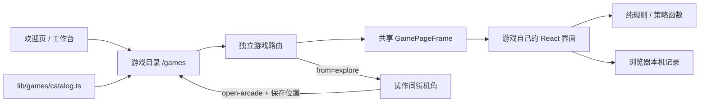

# 游戏室与扩展

游戏室是个人主页里的独立休息区。文章、作品和档案仍可以直接访问，探索和游戏成绩不会解锁或限制内容。新游戏先做好自己的玩法和页面，再加入轻量目录；不为几款游戏搭建通用插件系统或空后台。

## 入口与页面

| 地址 | 功能 |
| --- | --- |
| `/games` | 选择实际可玩的游戏 |
| `/games/holdem-lab` | 与本地 AI 进行德州扑克单挑练习，逐手复盘 |
| `/games/signal-pulse` | 十二关灯阵，支持选关、提示、撤回与重来 |
| `/games?from=explore` | 从机甲街机角进入，主要返回入口为机甲 |

欢迎页的游戏室链接作为次要入口，保留工作台和进入机甲的选择。工作台通过主导航和侧栏通向游戏室。机甲内部的试作间设有可交互街机角；直接访问游戏页面时不需要先启动 Phaser 世界。

`?from=explore` 只记录来路，不包含用户资料或游戏成绩。选择游戏后继续保留此参数，返回游戏室时也保留；「返回机甲」统一打开 `/explore`，让世界读取已有本机存档，不使用 scene 参数重新指定场景。世界离开前停止输入并保存位置，返回后仍在原场景的街机旁；世界布局版本变化或存储不可用时按原有安全出生点恢复。

## 模块边界

| 文件或目录 | 职责 |
| --- | --- |
| `lib/games/catalog.ts` | 稳定 ID、路由与游戏目录文案 |
| `app/games/page.tsx` | 游戏室页面，读取来路参数 |
| `components/games/game-room.tsx` | 目录展示与共享 `GamePageFrame` |
| `components/games/games.css` | 导航、目录、页框、手机布局与减少动态效果 |
| `lib/games/holdem-engine.ts` | 发牌、盲注、合法行动、换街与底池结算 |
| `lib/games/holdem-cards.ts` | 牌型比较与蒙特卡洛权益估计 |
| `lib/games/holdem-strategy.ts` | 本地 AI 行动与策略复盘 |
| `components/games/holdem-worker.ts` | 将权益和复盘计算放到 Worker 中 |
| `lib/pulse-puzzle.ts` | 灯阵关卡、按键翻转与最短解求解 |
| `components/home/pulse-game.tsx` | 两种入口共同复用的灯阵界面 |
| `lib/world/registry.ts` | 机甲内街机节点、站位与家具定义 |
| `lib/world/arcade-cabinet.ts` | 跟随室内透视绘制的街机纹理 |

目录只描述已经能打开的游戏，不依赖游戏内部状态。路由 ID 与中文名称分离；可以修改游戏标题和简介，而不随意改变分享地址。`GamePageFrame` 统一返回导航与 ICP 信息，游戏组件负责自己的操作、提示、胜负和记录。

入口使用完整文档导航，离开后释放计算 Worker 与游戏事件，探索位置由既有存档恢复。当前 Vinext 版本的 `next/link` 在生产产物自动预加载时会报错；这次按实际问题保留普通链接，不为通过该框架专用 lint 规则引入失效预加载。

## 德州扑克的实现范围

这是两人无限注德州扑克的虚拟练习桌。玩家与浏览器内 AI 对手轮流行动，经历翻牌前、翻牌、转牌、河牌和摊牌；也可以在任一下注阶段弃牌结束。筹码用于练习，不存在充值、提现、付费下注或真钱结算。

AI 使用本地混合启发式策略，提供均衡、稳健和积极风格。行动参考自身底牌、当前公共牌、底池赔率与下注状态，并加入随机混合；不是联网大模型对话，也不是远程对手。策略计算只使用对手自己的底牌与当前可见公共牌，不使用玩家隐藏底牌决定行动。

权益估计对未知对手底牌与剩余公共牌进行不放回抽样，假设对手持有所有合法未知组合的概率相同。显示值包含平局时的一半底池份额。它回答的是「对随机未知底牌的摊牌权益」，不是根据当前 AI 的历史行动推导出的范围胜率。少量抽样有波动，不能承诺精确百分比。

逐手复盘使用每次行动当时的公共牌、底池和跟注价格，解释底池赔率、价值下注、诈唬、位置与权益实现等思路。GTO 在这里是学习参考：**没有运行完整范围的均衡求解，没有精确 GTO 频率或策略树**。复盘不凭最终输赢直接判断当时决策好坏，也不把随机范围权益当作最优行动的证明。

练习记录使用 `localStorage` 键 `tscjj:holdem-practice:v1`，保存累计手数、胜局数、虚拟筹码净变化，以及最近八手的玩家底牌、公共牌和策略复盘。正在进行中的对局不存档，刷新后重新开局。它和机甲位置存档独立，不上传至文章内容源，也不随 GitHub 同步；不同浏览器、设备或清理站点数据后，记录不共享。存储被禁止时，仅在本次页面内保留记录。灯阵暂时只记录本次打开页面的完成情况与最佳步数，刷新重置。

## 新增一款游戏

1. 在 `app/games/<stable-id>/page.tsx` 建立独立可访问页面。交互组件放在 `components/games/`，复杂规则拆成 `lib/games/` 中的纯函数；只在访问对应页面时加载游戏。
2. 页面读取 `searchParams` 中的 `from`，将 `from === 'explore'` 传给 `GamePageFrame` 的 `fromExplore` 参数。共享外壳接收 `game` 与 `children`，无需再复制导航和备案页脚。
3. 完成可玩的规则、重开或返回流程，再扩展 `GameId` 并添加 `GAMES` 项。填写准确的 `id`、`title`、`description`、`href`、`category`、`controls`、`estimatedDuration`；需要专属预览时，在目录展示组件中补准确的示意，不能挪用另一款游戏的画面，也不要用假截图或未来功能填满目录。
4. 规则有必要时补纯函数验证。至少检查异常输入、可结束性和重新开始；有分数或记录时说明保存范围，并处理存储不可用。
5. 检查桌面与手机：控件可点击、无横向溢出、键盘焦点清楚，减少动态效果生效。核对从游戏室选游戏、独立地址刷新、返回游戏室、返回机甲和浏览器后退。
6. 运行 `npm run check` 和目标构建：自托管 Node 使用 `npm run build:node`；Sites 使用 `npm run build`。源码推送与服务器发布是两件事，部署步骤继续遵循 [自有服务器部署](SELF-HOSTING.md)。

已有街机角指向游戏室，添加第三款游戏不需要给角色控制核心新增分支，也不需要再放一个机甲地图物件。只有设计新的空间时才改 `SceneDefinition`、节点及地图导出。

## 修改后重点验证

- 扑克规则：牌型顺序、A2345、七张牌取最佳五张、平分底池、筹码守恒、短码全下、合法最小加注与重新开放加注。
- AI 与复盘：不读取隐藏底牌；抽样排除已知牌；平局份额、输入边界和复盘时点正确；文案不把启发式宣传为严格求解器。
- 灯阵：十二关可解、最短步数可靠、撤回与重来正确、五阶灯阵在窄屏仍可操作。
- 往返：从街机离开时停步，带来路参数选择游戏，返回原位；浏览器后退恢复页面时不冻结输入。
- 存储：只记录需要的本机结果，坏记录和不可用存储不会阻止开局；页面分享地址不携带个人记录。

本文件说明代码架构与维护方式。线上部署版本、发布日期及服务器操作记录单独维护在部署文档中。

## 规则与方法依据

- [Poker TDA 官方规则](https://www.pokertda.com/view-poker-tda-rules/)：单挑按钮与盲注、完整加注增量、短全下不重开加注、退回未被跟注的筹码。牌型和下注引擎为本项目原创实现。
- [PokerStars Learn：底池赔率](https://www.pokerstars.com/poker/learn/lesson/pot-odds/)：跟注价格除以跟注后的可争夺底池。有效底池须扣除短筹码无法匹配的超额投入。
- [DeepStack 论文](https://arxiv.org/abs/1701.01724)：严格的策略求解涉及范围、不完全信息和后续博弈价值；本项目的随机范围权益抽样不能替代这种求解。

复盘展示每次行动当时的公共牌，避免用最终牌面解释早先决策。Worker 被浏览器限制时，小量计算回退到主线程；等待本手复盘归档后才能开始下一手。
