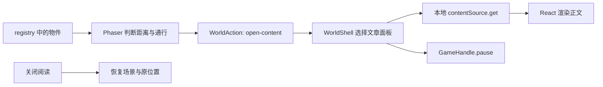

# 从一个物件开始：林间小院源码学习指南

这个案例最值得学习的是：把一个能看、能走、能读的页面拆成相互配合的几个部分。先理解一次互动的全过程，再尝试增加内容与场景，会比从头读完游戏引擎更容易。

所有路径均相对于本例目录 `examples/forest-courtyard/`。运行方式见 [README](README.md)。下面的三个练习是建议修改，仓库没有提前替你做完，便于自己动手对照。

## 一、先分清三个边界

打开 [types.ts](lib/world/types.ts)。只需要先记住这三个类型：

| 类型 | 回答的问题 | 在哪里使用 |
| --- | --- | --- |
| `SceneDefinition` | 这里是什么地方，从哪里进入，哪里能走，有哪些物件？ | `registry.ts`、地图导出、Phaser 场景 |
| `WorldAction` | 用户与物件互动后，想做什么？ | 互动节点、地图导航、React 面板 |
| `GameHandle` | React 可以怎样控制已经启动的世界？ | 创建、暂停、进入场景、触控、销毁 |

一次打开文章的流程如下：



Phaser 每帧处理位置、方向、碰撞和动画。React 管理目录、文章、小游戏面板与菜单。角色移动不需要每一帧都触发整页 React 重渲染；游戏也不用直接拼接文章的 HTML 界面。

`WorldAction` 是一组明确动作，包含 `open-content`、`open-collection`、`enter-scene`、`open-projects`、`open-game` 等。新增普通文章时，复用现有动作即可。只有需要展示新的内容类型时，再考虑扩展动作与展示组件。

## 二、场景不是一张图，也不是一组随意坐标

[registry.ts](lib/world/registry.ts) 中的 `SCENES` 是本例的场景配置入口。

| 稳定 ID | 空间 | 返回规则 |
| --- | --- | --- |
| `hub` | 林间小院 | 主枢纽 |
| `undergraduate` | 午后书屋 | 返回 `hub` 的 `blog` 出生点 |
| `graduate` | 日光工作室 | 返回 `hub` 的 `projects` 出生点 |
| `life` | 树影花园 | 返回 `hub` 的 `lounge` 出生点 |

这里同时存在三套信息，修改时要保持一致：

1. **视觉信息**：`art` 是底图，`layers` 是独立房屋、树、家具等，`doors` 控制门与开门反馈。
2. **空间规则**：`walkable` 描述地面区域，`obstacles` 描述家具等占地，`spawnPoints` 描述进入与返回的位置。
3. **内容意图**：`nodes` 放物件站位、名称、提示、互动范围与 `action`。

互动节点的坐标表示角色能够接近的站位，通常放在桌前、书架前或门前。把节点直接放进桌面或墙体里，即使画面看起来正确，也会造成无法互动。`radius` 控制互动距离，但它不应该用来补救一个不可达的站位。

场景坐标使用固定的 **1536 × 1024** 逻辑画布，原点在左上角，向右为 x 增大，向下为 y 增大。屏幕适配由相机与显示尺寸处理；不能把手机屏幕像素直接写进地图坐标。

### 地图文件由谁维护

本例以 `registry.ts` 为配置来源。[generate-maps.ts](scripts/generate-maps.ts) 将地面、障碍与互动节点导出为 `public/maps/*.json`，采用 Tiled 的对象图层结构。它们不是人工维护的第二份业务配置。

修改节点、地面或障碍后运行：

```bash
npm run maps
npm run check
```

`check` 会对照注册表和地图文件，检查资源存在、ID 唯一、出生点、返回点、节点可达性、入口引用和文章引用。可以用 Tiled 查看导出的几何，但直接修改导出文件会被下一次 `maps` 覆盖；需要双向编辑时，应另外实现可靠的导入流程。

## 三、顺着一次移动看几何与动画

[geometry.ts](lib/world/geometry.ts) 负责点是否在多边形内。[navigation.ts](lib/world/navigation.ts) 再把它组织成几个更有用的判断：

- `traversable` 检查脚点中心与四个方向的偏移点，默认偏移半径为 5，避免只有中心通过、角色脚边却擦进家具。
- `clearSegment` 检查整段移动路径与多边形边界的交点区间，避免一步跨过狭窄障碍。
- `findRoute` 先尝试直达；被挡住时，使用间距 16 的有限网格进行 A* 搜索，再用 `clearSegment` 缩减多余拐点。

点击寻路与每帧实际位移共用这些判断。这一点很关键：如果寻路允许穿过某个位置，移动却不允许，角色就会不断朝一个永远到不了的目标前进。反过来，若只检查终点，较大的时间步长又可能让角色跨过细墙。

网格搜索仍有取舍。窄到放不下搜索网格的通道可能找不到绕行路线，即使几何上存在很细的空隙。所以场景应该留下合理通道，检查脚点与转角；不要用缩小碰撞半径的方式掩盖所有问题。

角色素材在 [player.ts](lib/world/player.ts) 中以 Canvas 绘制：四个方向，每个方向八帧，左右手脚反向摆动。`engine.ts` 根据实际移动距离选择帧：

```ts
const frame = moved > 0.05 ? Math.floor(this.travel / 12) % 8 : 0;
```

这里的 `travel` 累积实际走过的距离。撞墙没有位移时不会继续原地快走；停下则回到站立帧。改善动画时应同时看步幅、速度与素材脚点，单纯增加帧数不一定解决滑步或比例不协调。

## 四、前景遮挡和碰撞是两件事

看 [courtyard-layers.ts](lib/world/courtyard-layers.ts)、[interior-layers.ts](lib/world/interior-layers.ts) 和 [scenery.ts](lib/world/scenery.ts)。`SceneryLayer` 中容易混淆的是这些字段：

| 字段 | 含义 |
| --- | --- |
| `x`、`y` | 素材锚点放到世界中的位置 |
| `anchor` | 素材原图中的锚点，不是世界坐标 |
| `sourceWidth`、`width` | 决定绘制比例，缩放值为 `width / sourceWidth` |
| `outline` | 在原图中裁出可见素材范围，使用原图坐标 |
| `depth` | 可选的固定排序值；默认取 `layer.y - 20` |
| `canopy` | 为树冠、灌木启用遮挡时的透明反馈 |
| `nodeId` | 点击这块素材时连接哪个互动节点 |

静态轮廓会在创建场景时裁成独立纹理，不必每帧重新计算整张图的遮罩。角色的绘制深度则跟随脚点 y 值。角色走到家具前面或后面时，二者排序发生变化，才有明确的前后关系。

但 `outline` 不会自动变成行走障碍。树冠负责遮挡，树干负责挡住脚步；家具上半部分可以遮住角色，真正阻挡行走的是占地部分。视觉轮廓和碰撞轮廓有不同目的，不能简单复制一个矩形同时使用。

这也解释了旧版为什么仍有「像贴图」的地方：拆图层只是一个条件，光影、透视、人物比例、道路宽度和脚点仍要相互一致。自动检查能发现不可达，却不能判断树是否太大、门是否太窄，最后仍要从玩家视角走一遍。

## 五、打开阅读后，为什么不会继续走

[world-shell.tsx](components/world/world-shell.tsx) 在挂载后动态导入 `engine.ts`，调用 `createWorld`，将返回的 `GameHandle` 保存到 ref。React 的动作处理函数打开对应面板，例如 `open-content` 调用本地的 `contentSource.get`。

当 `panel`、地图、帮助或欢迎页打开时，effect 调用：

```ts
game.current?.pause(!!panel || blueprint || help || welcome);
```

`GameHandle.pause` 清空触控方向、处理输入状态并暂停 Phaser 场景。关闭面板只恢复已有场景，不重新创建一个角色。失焦与切到后台也会清除移动输入，避免释放按键的事件没有送达时发生持续移动。

卸载时，React 会中止过期的文章读取、调用 `destroy`；引擎保存位置，移除它安装的窗口监听器，并销毁 Phaser 实例。观察这些清理动作，比只看初始化代码更能理解为什么从独立文章页返回后不会叠出多个 Canvas。

本例保留了文章读取的异步接口和取消结果检查，但数据实际来自本地 JSON，不会请求旧站点的 `/api/content/...`。这让内容来源可以更换，而移动逻辑不用跟着修改。

独立阅读页位于 [App.tsx](app/App.tsx)，通过 Hash 路由直接展示同一份文章数据。场景内阅读和独立阅读是两个入口，共用内容与正文组件。

## 六、三个渐进练习

每做完一项，先检查，再保存一次 Git 提交。下一项从上一项的结果继续。练习不要求修改 `engine.ts` 的移动核心。

### 练习 1：增加一个能打开内容的地面节点

目标是理解「地图站位 → 动作 → 内容」的完整连接。

在 `registry.ts` 找到 `id: 'life'` 的场景，向它的 `nodes` 数组添加：

```ts
{
  id: 'learning-note',
  x: 768,
  y: 713,
  label: '我的学习记录',
  hint: '看看这个小院如何由场景数据组成。',
  radius: 40,
  action: {
    type: 'open-content',
    contentId: 'lesson-scene-definition',
  },
},
```

这是花园当前的有效出生点，用它可以先排除站位错误。它是教学用节点，没有新增记录册图片；真正设计物件时，下一步应把节点移到可见物件前方，并与对应图层关联。

运行 `npm run maps` 和 `npm run check`，从小院进入花园，接近提示后按 E 打开文章。关闭面板，再走向花园出口，确认仍能返回小院。也可以使用 `http://127.0.0.1:5173/?scene=life` 快速定位花园进行调试。

**完成条件：** 检查报告中的可达节点数量从 20 变成 21；文章能打开；阅读时方向键不移动角色；关闭后恢复原位置；原来的出口和小游戏仍可达。

### 练习 2：增加文章，目录不改地图

目标是验证文章可以独立维护，不需要每篇文章再复制一张地图。

在 `lib/content/catalog.json` 的 `posts` 数组增加一个对象。注意相邻对象间需要逗号：

```json
{
  "id": "lesson-my-first-change",
  "slug": "my-first-change",
  "title": "我的第一次场景修改",
  "chapter": "life",
  "status": "published",
  "date": "2026-09-09",
  "tags": ["动手练习"],
  "summary": "记录新增节点时的判断、修改和验证。",
  "readingMinutes": 1,
  "html": "<h2>我改了什么</h2><p>在花园增加了一个可达的教学节点。</p><h2>我怎样验证</h2><p>检查地图，并亲自完成打开文章与返回。</p>",
  "headings": [],
  "sourceURL": ""
}
```

`id` 用于内容引用，`slug` 用于阅读地址，两者应该稳定且不能与已有文章重复。`chapter` 决定它进入哪个栏目。`source.ts` 会自动生成摘要列表，不需要另建一份手写目录。

运行 `npm run check` 和 `npm run build`，打开 `/#/archive`，以及 `/#/posts/my-first-change`。再进入书屋查看全部文章和对应栏目。所有这些入口应该显示同一篇文章。

最后，把练习 1 节点的 `contentId` 改成 `lesson-my-first-change`，重新运行 `npm run maps`、`npm run check`，验证场景物件也能打开它。这一步是选择一个物件直接展示文章；仅仅把文章收录进目录，无需修改地图。

**完成条件：** 目录自动出现第四篇文章，栏目和标签筛选正确，独立地址刷新仍可读，节点引用与正文一致。当前检查会验证节点引用，但维护者仍应核对新文章的 ID、slug 与可读内容，不应只看命令退出成功。

### 练习 3：让一棵树既能遮挡，也能阻挡

目标是亲手区分图层锚点、脚点深度和树干碰撞。

在 `courtyard-layers.ts` 的 `COURTYARD_LAYERS` 中增加一个树的副本：

```ts
{
  id: 'learning-tree',
  art: '/art/courtyard-tree.png',
  x: 825,
  y: 580,
  width: 155,
  anchor: { x: 525, y: 1418 },
  sourceWidth: 1024,
  canopy: true,
},
```

先运行页面，从树的前后经过。此时只有新图层，并没有新的碰撞。观察角色虽然会受图层遮挡，但脚点仍可能走过树干所在的位置。

然后在 `registry.ts` 中 `hub` 的 `obstacles` 数组新增树干占地：

```ts
[
  [817, 574],
  [833, 574],
  [833, 587],
  [817, 587],
],
```

这组坐标作为练习起点，已用当前几何规则检查，原有节点仍能从出生点到达；它不是免于视觉校准的最终摆放。树干在图片中的实际位置、透明区域与透视，需要你在浏览器里对照脚点观察。

运行 `npm run maps`、`npm run check`，分别用键盘和点击寻路从树两侧经过。应当能绕树行走，不能直穿树干；站到树后会被遮挡，站到前面则显示在树前。如果发现脚底位置对不上，优先核对 `anchor` 与地面占地，而不是把整个树冠都设为障碍。

移动树的位置时，也要平移树干多边形。若改变已发布场景的通行布局，可递增该场景的 `layoutVersion`，使旧存档回到有效默认出生点，避免用上一次位置误判修改结果。

**完成条件：** 所有原有入口、出生点和节点仍通过检查；键盘与点击寻路的结果一致；树干阻挡与可见位置匹配；移动角色观察前后排序没有突然盖错。最后打开一个阅读面板再关闭，确认新增物件没有影响原本的阅读流程。

## 七、看懂轻量玩法，再决定要不要增加

[puzzles.ts](lib/world/puzzles.ts) 将电路规则做成纯函数：北、东、南、西接口使用 1、2、4、8 四个位，旋转就是移动这些位；连通判断从入口出发遍历，只有到达右下格且出口向右连通才完成。界面在 [mini-games.tsx](components/world/mini-games.tsx) 中读取结果并绘制。

记忆配对将四种信号各放两张，再洗牌。它没有复杂关卡生成，因此适合看清「规则状态与界面状态分开」这一点。完成结果通过 `completeGame` 回传，世界保存最佳步数；电路完成还会影响工作室模型的装甲状态。

足球的速度衰减、碰撞、进球区域和短暂反馈在 `scenery.ts` 中。这个实现能证明物件可运动，却不足以构成长期有趣的游戏。若继续改，可以先设计一个明确的小目标，例如把球送到一个看得见的目标处并触发一次环境反馈，然后观察玩家是否理解；没有必要立即增加积分榜、复杂物理与大量关卡。

## 八、从历史案例反推个人主页的设计

这个版本有完整的场景机制，但机制成立不等于主页好用。判断修改是否有效，可以回到三个实际任务：访客能不能迅速找到文章，能不能理解作者在做什么，愿意多停留时有没有值得探索的反馈。

保留直接阅读入口，是因为不同访客的时间和目的不同。文章、项目、个人资料应该有稳定入口；探索是另一种接近它们的方式。门的方向、物件的外观与交互反馈，则负责让愿意探索的人感到空间合理。

因此，本例适合学习场景注册、输入、几何、遮挡、生命周期和内容连接。真正用于自己的主页前，还要围绕内容重新审视动线、人物比例、素材大小和手机阅读。现行个人主页在仓库根目录继续维护，可以将两个实现放在一起比较：哪些机制值得保留，哪些设计是在增加访问成本。
