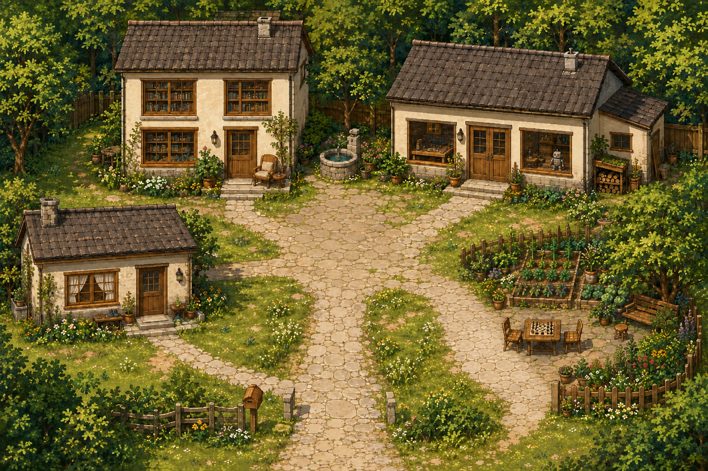

# 林间小院：一个可以走进去的 React + Phaser 学习案例

这是个人主页早期「林间漫步」方向的独立学习版本：从院子出发，进入书屋、工作室和花园，通过场景中的物件打开文章、项目与小游戏。它保留了当时的场景结构和实现方式，适合对照源码学习交互式主页。



*上图是历史场景原画，供了解美术方向；不是当前浏览器运行截图。运行时的地面、建筑、树木、角色和界面由多个图层组成。*

本例来自提交 [`archive/forest-courtyard`](https://github.com/1205240810/personal-homepage/tree/archive/forest-courtyard)。现行个人主页仍在仓库根目录维护，两者有独立的入口、依赖和构建产物。这里的内容已换成三篇教学笔记与两个公开项目外链，不包含私人文章、个人经历档案或后台配置。

## 先运行起来

推荐使用 **Node.js 24 LTS**；本例声明的最低版本为 Node.js 22.13.0。以下命令从仓库根目录执行：

```bash
cd examples/forest-courtyard
npm ci
npm run dev
```

打开 [http://127.0.0.1:5173/](http://127.0.0.1:5173/)。首次启动会显示开始菜单，可以进入小院，也可以直接阅读。安装依赖需要网络；本地场景、教学文章和音乐均随目录提供，无需登录、API 密钥、数据库或 Sites 托管绑定。项目源码与演示的外链仍会打开对应网站。

| 命令 | 作用 |
| --- | --- |
| `npm run dev` | 开发预览，固定使用本机 `5173` 端口 |
| `npm run check` | 类型检查、地图与内容引用校验、碰撞寻路和小游戏规则检查 |
| `npm run maps` | 根据 `lib/world/registry.ts` 重新生成四张 Tiled JSON 地图 |
| `npm run build` | 类型检查并生成 `dist/` |
| `npm run preview` | 预览构建产物，使用本机 `4173` 端口 |

端口已被占用时，开发命令会报错并退出，不会悄悄切换端口。完成本例的 `npm ci` 后，也可以在仓库根目录使用 `npm run example:forest`、`npm run check:forest` 和 `npm run build:forest`。

## 怎样探索

| 操作 | 方式 |
| --- | --- |
| 移动 | WASD、方向键，或点击可通行地面 |
| 与物件互动 | 靠近后按 E，或点击可互动物件让角色走过去 |
| 查看地图 | 按 M，或点击界面地图入口 |
| 踢球 | 靠近小球后按 F，或点击小球 |
| 手机操作 | 屏幕方向按钮、互动按钮与点击移动 |
| 阅读与返回 | 从目录或物件打开内容，关闭面板后恢复原来的位置 |

院子是主枢纽，三处入口分别通往午后书屋、日光工作室和树影花园。各房间出口返回对应门前。地图和直接阅读入口始终可以使用，阅读不需要先完成小游戏。

本例保留电路旋转、八张卡片的记忆配对、简单踢球，以及模型和猫咪的小彩蛋。打开阅读、地图、帮助或开始菜单时，移动会暂停。音乐默认关闭，需要主动开启；阅读时会降低音量，切到后台时暂停。

直接阅读地址使用 Hash 路由：

- `/#/archive`：三篇教学笔记。
- `/#/posts/scene-definition`：场景配置笔记。
- `/#/posts/movement-and-reading`：移动与阅读切换笔记。
- `/#/posts/depth-and-design`：图层与空间设计笔记。
- `/#/about`：本案例的说明。
- `/#/projects`：公开项目外链示例。

这些页面可以直接访问和刷新，不依赖服务端重写规则。场景加载失败时，可以直接打开 `/#/archive` 阅读。

## 建议的学习顺序

先通读 [学习指南](LEARNING_GUIDE.md)，再沿着一次「走到记录册 → 打开文章 → 关闭返回」追踪代码。

| 文件 | 应该关注什么 |
| --- | --- |
| [app/App.tsx](app/App.tsx) | 场景首页与独立阅读页怎样共存 |
| [lib/world/types.ts](lib/world/types.ts) | `SceneDefinition`、`WorldAction`、`GameHandle` 三个边界 |
| [lib/world/registry.ts](lib/world/registry.ts) | 四张地图、出生点、道路、障碍和互动节点 |
| [components/world/world-shell.tsx](components/world/world-shell.tsx) | React 如何创建、暂停和销毁 Phaser，以及如何打开阅读面板 |
| [lib/world/engine.ts](lib/world/engine.ts) | 移动、互动、转场、存档和反馈的运行过程 |
| [lib/world/navigation.ts](lib/world/navigation.ts) | 为什么寻路和实际移动要使用相同的通行判定 |
| [lib/world/scenery.ts](lib/world/scenery.ts) | 素材裁切、锚点、脚点排序、前景与门的反馈 |
| [lib/world/player.ts](lib/world/player.ts) | 程序绘制的四方向、八帧步态角色 |
| [lib/content/catalog.json](lib/content/catalog.json) | 三篇教学文章的数据；目录自动从这里读取 |

教程包含三个渐进练习：增加可互动的教学节点、补充一篇自动进入目录的文章、同时配置树木图层与树干碰撞。每个练习都有操作步骤和验收方式。

## 与历史原版的关系

独立化保留了四张地图、主要 React 场景组件、Phaser 世界模块、14 张原画和原背景音乐。为便于学习，进行了以下适配：

1. 使用单独的 Vite + React 入口与锁文件，移除对旧站点服务器和托管环境的依赖。
2. 将文章接口读取改为本地 `contentSource.get`，使用三篇明确标注的教学文章。
3. 将个人档案替换为案例说明，项目区仅展示两个公开项目的链接资料。
4. 为独立文章、目录和说明页提供 Hash 路由，避免离开场景后链接失效。
5. 给探索存档、开始菜单状态和音量使用 `forest-courtyard-example-` 前缀，避免与现行站点相互影响。
6. 保留地图生成与几何检查脚本，并将文章引用校验接到本地教学目录。

场景和栏目中的 `undergraduate`、`graduate`、`life` 是历史稳定 ID，保留它们是为了便于对照历史代码；本例显示的是教学内容，它们不代表当前个人资料。

更晚的 [`archive/river-journey`](https://github.com/1205240810/personal-homepage/tree/archive/river-journey) 已演变为「河谷漫游」，加入河道、水闸、浮桥与索道，不属于本目录。完整历史保留在 Git 中，便于继续研究两种设计的差异。

## 维护边界与已知局限

这里是保留历史机制的学习分支式案例，没有和仓库根目录自动同步。修改本例不会自动改变现行主页；反过来，当前站点的新功能也不会自动进入本例。修改场景后应依次运行 `npm run maps`、`npm run check`、`npm run build`，再实际检查移动、遮挡、互动与阅读返回。

- 草地的可见边界与可走区域、人物和室内物件的比例，仍保留早期设计中的局限。几何检查通过只证明规则可达，不代表视觉上没有空气墙或比例问题。
- 足球是简单的碰撞与进球反馈，没有完整关卡和持续目标；电路与记忆配对也是轻量玩法，不是正式游戏系统。
- 原画共约 **34.5 MB**。为保留学习依据，此处没有重新压缩或重绘；不能将它当作移动端加载性能的最佳示范。
- 角色由代码绘制，使用八帧步态；它不是后续版本的人物素材，也不是精细骨骼动画案例。
- 地图的逻辑画布为 **1536 × 1024**。改变场景尺寸需要一起检查相机、坐标边界、地图导出与寻路网格，不能只更换一张不同尺寸的背景图。
- 当前 `/art/...`、`/maps/...` 和 `/audio/...` 使用站点根路径。若部署到带子路径的静态站点，需要统一调整资源地址；仅修改 Vite `base` 不足以重写这些字符串。
- 本例没有发布前审核、后台编辑或远程数据同步。`catalog.json` 中的 HTML 由维护者编写并直接展示；导入外部正文时，应参照现行站点的内容清理流程，不能把本例当作任意 HTML 上传入口。

浏览器存档只保存在当前设备。需要从头体验时，可以在开发者工具中删除带 `forest-courtyard-example-` 前缀的本地存储项和会话存储项，再刷新。

## 参考与许可

参考项目、依赖许可及音乐署名见 [THIRD_PARTY_NOTICES.md](THIRD_PARTY_NOTICES.md)。本例保留 **Morning — Kevin MacLeod** 的 CC BY 4.0 署名及许可证入口。

仓库目前没有为项目整体设置开源许可证。原始代码、教学文字和原创场景资产的保存与展示，不等于授予任意复制、再分发或商用的许可；第三方材料分别遵循其自身许可证。
